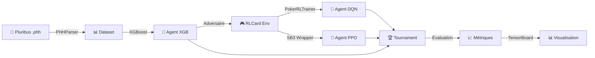

<p align="center">
  <h1 align="center">🃏 RL_phase2 — AI Poker Agent Framework</h1>
  <p align="center">
    <strong>Deep Reinforcement Learning & Supervised Learning pour le No-Limit Texas Hold'em 6-max</strong>
  </p>
  <p align="center">
    
    
    
    
    
    <a href="LICENSE"></a>
  </p>
</p>

---

## ⚠️ **Avertissement Éthique & Usage Responsable**

> [!CAUTION]
> **Ce projet est STRICTEMENT réservé à la recherche académique en intelligence artificielle et théorie des jeux.**
> Toute utilisation commerciale ou à des fins de triche est **formellement interdite**.

Ce projet est destiné **exclusivement** à la recherche en intelligence artificielle, théorie des jeux et mathématiques appliquées.

### 🚫 Usages interdits

| Usage | Statut |
|---|---|
| Triche ou aide en temps réel sur des sites de poker en ligne | **❌ INTERDIT** |
| Exploitation commerciale (vente, SaaS, API payante) | **❌ INTERDIT** |
| Contournement des CGU des plateformes de poker | **❌ INTERDIT** |
| Développement de bots jouant avec de l'argent réel | **❌ INTERDIT** |
| Recherche académique, éducation, expérimentation personnelle | ✅ Autorisé |
| Publication scientifique (avec citation) | ✅ Autorisé |

### ⚖️ Conformité légale

- Les plateformes de poker en ligne (PokerStars, GGPoker, Winamax, etc.) **interdisent explicitement** l'utilisation d'outils d'aide à la décision en temps réel. Tout contrevenant s'expose à la **fermeture de compte** et à des **poursuites légales**.
- Les modèles entraînés sur des données Pluribus sont soumis aux licences des auteurs originaux (Meta AI Research).
- L'utilisation de ce logiciel doit respecter les **lois locales** applicables aux jeux d'argent.
- Ce projet est distribué sous licence **[CC BY-NC 4.0](LICENSE)** — voir la section [Licence](#-licence).

---

## 🙏 Remerciements

Ce travail repose sur les contributions de la communauté scientifique et open-source :

### Données d'entraînement
- **Pluribus** (Meta/Facebook AI Research) :
  Données de parties publiées par [Noam Brown et Tuomas Sandholm](https://science.sciencemag.org/content/365/6456/885) (Science, 2019).
  Accès via le projet **[Poker-Hand-History](https://github.com/uoftcprg/poker-hand-history)** (University of Toronto CPRG).

### Outils open-source
- [RLCard](https://github.com/datamllab/rlcard) (environnement poker pour RL)
- [Treys](https://github.com/ihendley/treys) (évaluation de mains)
- [Stable-Baselines3](https://github.com/DLR-RM/stable-baselines3) (implémentation PPO/DQN)

---

## 📋 Table des matières

- [Vue d'ensemble](#-vue-densemble)
- [Architecture](#-architecture)
- [Fonctionnalités](#-fonctionnalités)
- [Installation](#-installation)
- [Démarrage rapide](#-démarrage-rapide)
- [Modules en détail](#-modules-en-détail)
  - [Core — GameState](#core--gamestate)
  - [Agents](#agents)
  - [Features — Feature Engineering](#features--feature-engineering)
  - [Adapters — Multi-source](#adapters--multi-source)
  - [Training — Entraînement RL](#training--entraînement-rl)
  - [Parsers — Données Pluribus](#parsers--données-pluribus)
- [Pipeline d'entraînement](#-pipeline-dentraînement)
- [Live Assistant — Aide en temps réel](#-live-assistant--aide-en-temps-réel)
- [Évaluation & Tournois](#-évaluation--tournois)
- [Configuration](#%EF%B8%8F-configuration)
- [Roadmap](#-roadmap)
- [Stack technologique](#-stack-technologique)
- [Licence](#-licence)
- [Contribuer](#-contribuer)

---

## 🎯 Vue d'ensemble

**RL_phase2** est un framework de recherche combinant :
- **Apprentissage par Renforcement** (DQN, MaskablePPO)
- **Apprentissage Supervisé** (XGBoost entraîné sur les données de [Pluribus](https://science.fb.com/publications/superhuman-ai-for-multiplayer-poker/))

pour créer des agents compétitifs au **No-Limit Texas Hold'em 6-max**.

### Philosophie du projet

```text
Données Pluribus (.phh)  ──►  XGBoost (Imitation Learning)  ──►  Adversaire expert
                                                                        │
Environnement RLCard     ──►  DQN / MaskablePPO (RL)        ──►  Agent  │ vs
                                                                        │
                              Feature Extractor (87 dims)    ◄──  GameState standardisé
```

## 🏗 Architecture

```
RL_phase2/
├── core/                    # 🔴 Noyau — Structures de données
│   └── game_state.py        #     GameState : état standardisé du jeu
│
├── agents/                  # 🟢 Agents IA
│   ├── dqn.py               #     SmartDQNAgent (RLCard + Features)
│   ├── ppo.py               #     PPOAgent (Gym wrapper pour SB3)
│   ├── xgboost_agent.py     #     XGBoostRLCardAgent (Pluribus-trained)
│   ├── human_console.py     #     Agent humain (interface console)
│   └── dqn_training.py      #     Script de lancement DQN
│
├── features/                # 🟡 Feature Engineering
│   ├── feature_builder.py   #     FeatureExtractor (87 features)
│   └── feature_sota_drl.py  #     Features SOTA pour DRL
│
├── adapters/                # 🔵 Adaptateurs multi-sources
│   ├── rlcard_adapter.py    #     RLCard → GameState
│   └── pluribus_adapter.py  #     Pluribus (.phh) → GameState
│
├── training/                # 🟠 Infrastructure d'entraînement
│   ├── config.py            #     Configurations type-safe (dataclasses)
│   ├── trainer.py           #     PokerRLTrainer (agnostique)
│   ├── trainer_sb3.py       #     Entraîneur MaskablePPO (SB3)
│   ├── sb3wrapper.py        #     PokerSB3Wrapper (Gymnasium env)
│   └── callbacks.py         #     Callbacks (Progress, Metrics, EarlyStopping, TensorBoard)
│
├── parsers/                 # 🟣 Parsing de données
│   ├── phh_parsers.py       #     Parser Pluribus Hand History (.phh)
│   └── parse_data.py        #     Utilitaires de conversion
│
├── data/                    # 📦 Données
│   ├── script_pluribus.ipynb#     Notebook d'exploration Pluribus
│   └── xgb_pluribus_v1.pkl  #     Modèle XGBoost pré-entraîné
│
├── tests/                   # 🧪 Tests & Benchmarks
│   ├── test_agent.py        #     Tests des agents
│   ├── test_feature_builder.py#   Tests du feature extractor
│   ├── test_sb3_env.py      #     Tests de l'env Gymnasium
│   ├── test_params.py       #     Tests des hyperparamètres
│   ├── tournament.py        #     Tournoi XGBoost vs DQN
│   └── explore_rlcard.py    #     Exploration de l'API RLCard
│
├── live_poker_pro.py        # 🎰 Assistant live (Rich UI)
├── live_assistant.py        # 🎰 Assistant live (CLI)
├── play_human.py            # 🕹️  Mode Humain vs IA
├── plot_results.py          # 📊 Visualisation TensorBoard
├── convert_to_json.py       # 🔄 Conversion modèle pkl → json
└── requirements.txt         # 📋 Dépendances Python
```

---

## ✨ Fonctionnalités

| Fonctionnalité | Description | Status |
|---|---|---|
| 🧠 **SmartDQN** | Agent DQN avec features intelligentes (override de RLCard) | ✅ |
| 🚀 **MaskablePPO** | PPO avec action masking via SB3-Contrib | ✅ |
| 🌲 **XGBoost Agent** | Imitation learning à partir de Pluribus | ✅ |
| 🎯 **87 Features** | Feature engineering avancé (cartes, position, GTO) | ✅ |
| 🔄 **Adapters** | Support multi-source (RLCard + Pluribus .phh) | ✅ |
| ⚙️ **Config system** | Configurations type-safe avec presets (quick, standard, Kaggle) | ✅ |
| 📊 **TensorBoard** | Monitoring temps réel des métriques | ✅ |
| 🎰 **Live Assistant** | Assistant poker en temps réel (Rich UI) | ✅ |
| 🕹️ **Human vs AI** | Mode de jeu humain contre les agents | ✅ |
| 🏆 **Tournois** | Benchmark automatisé entre agents | ✅ |
| 💾 **Checkpointing** | Sauvegarde/reprise device-agnostic (CPU ↔ GPU) | ✅ |
| 🔁 **Callbacks** | EarlyStopping, MetricsCallback, SmartCheckpoint | ✅ |
| 📐 **Multi-CPU** | Entraînement parallèle via `SubprocVecEnv` | ✅ |
| 🤖 **Self-play** | Configuration prête pour le self-play | 🔜 |

---

## 🚀 Installation

### Prérequis

- Python **3.10+**
- pip ou conda
- (Optionnel) GPU CUDA pour l'entraînement accéléré

### Setup

```bash
# 1. Cloner le repository
git clone https://github.com/<votre-user>/RL_phase2.git
cd RL_phase2

# 2. Créer un environnement virtuel
python -m venv venv
source venv/bin/activate  # macOS/Linux
# venv\Scripts\activate   # Windows

# 3. Installer les dépendances
pip install -r requirements.txt
```

### Dépendances principales

| Package | Version | Rôle |
|---|---|---|
| `torch` | ≥ 2.0.0 | Réseaux de neurones (DQN) |
| `rlcard` | ≥ 1.0.5 | Environnement de poker |
| `xgboost` | 1.7.6 | Agent supervisé |
| `sb3-contrib` | latest | MaskablePPO |
| `treys` | 0.1.8 | Évaluation de mains |
| `rich` | 14.3.1 | Interface terminal |
| `matplotlib` | ≥ 3.7.0 | Visualisation |
| `scikit-learn` | ≥ 1.3.0 | Utilitaires ML |
| `imbalanced-learn` | ≥ 0.11.0 | Rééquilibrage classes |
| `pandas` | ≥ 2.0.0 | Manipulation de données |

---

## ⚡ Démarrage rapide

### 1. Jouer contre l'IA (Humain vs XGBoost)

```bash
python play_human.py
```

Vous incarnez le Joueur 5 (position BTN) face à un agent XGBoost entraîné sur les données Pluribus, accompagné de 4 joueurs aléatoires.

### 2. Lancer l'assistant poker live

```bash
# Version Rich (interface premium)
python live_poker_pro.py

# Version CLI (terminal simple)
python live_assistant.py
```

L'assistant analyse votre main en temps réel et vous conseille l'action optimale avec niveaux de confiance.

### 3. Entraîner un agent DQN

```bash
python agents/dqn_training.py
```

### 4. Entraîner un agent PPO (MaskablePPO)

```bash
python training/trainer_sb3.py
```

Lance l'entraînement parallèle sur tous les cœurs CPU avec sauvegarde automatique et TensorBoard.

### 5. Lancer un tournoi d'évaluation

```bash
python tests/tournament.py
```

Compare les agents XGBoost vs DQN sur 10 000 mains.

### 6. Visualiser les résultats

```bash
# Via le script intégré
python plot_results.py

# Ou via TensorBoard
tensorboard --logdir=logs
```

---

## 📦 Modules en détail

### Core — GameState

Le cœur du système est le `GameState` — une dataclass Python qui standardise l'état du jeu, **indépendamment de la source** (RLCard ou Pluribus).

```python
@dataclass
class GameState:
    hole_cards: List[str]        # ['As', 'Kd']
    board: List[str]             # ['Jh', '9c', '4s']
    street: str                  # 'preflop' | 'flop' | 'turn' | 'river'
    position: str                # 'BTN' | 'SB' | 'BB' | 'UTG' | 'MP' | 'CO'
    num_active_players: int
    pot_size: int
    stack: int
    big_blind: int
    amount_to_call: int
    legal_actions: List[str]
    actions_this_street: List[str]
```

**Propriétés calculées dynamiquement** : `effective_stack_bb`, `pot_odds`, `spr` (Stack-to-Pot Ratio), `is_all_in_situation`, `is_heads_up`.

---

### Agents

#### SmartDQNAgent (`agents/dqn.py`)

Étend le `DQNAgent` de RLCard en injectant le `FeatureExtractor` custom à la place des observations brutes. Supporte checkpoint device-agnostic (CPU ↔ GPU).

```python
agent = SmartDQNAgent(
    env=env,
    mlp_layers=[256, 128],
    replay_memory_size=50000,
    learning_rate=0.00005,
    epsilon_decay_steps=100000
)
```

#### XGBoostRLCardAgent (`agents/xgboost_agent.py`)

Agent supervisé entraîné par imitation learning sur les décisions de Pluribus. Supporte les formats `.pkl`, `.json` et `.ubj`.

```python
agent = XGBoostRLCardAgent(
    model_path='models/xgb/xgb_pluribus_V1.json',
    env=env,
    use_safe_mode=True  # Fallback sécurisé en cas d'erreur
)
```

**Stratégie de mapping intelligente** :
- `RAISE` non disponible + conviction > 70% → `ALL-IN`
- `RAISE` non disponible + conviction ≤ 70% → `CALL`

#### PPOAgent (`agents/ppo.py`)

Wrapper Gym pour utiliser PPO/MaskablePPO via Stable-Baselines3. Inclut un `LegalActionWrapper` qui masque les actions illégales pendant l'inférence.

---

### Features — Feature Engineering

Le `FeatureExtractor` (`features/feature_builder.py`) produit un vecteur de **87 features** à partir de n'importe quel `GameState` :

| Catégorie | # Features | Exemples |
|---|---|---|
| 🃏 **Cartes** | 22 | Rank, suited, paire, force de main (Treys), texture du board |
| 📍 **Position** | 6 | Position normalisée, distance au BTN, early/middle/late |
| 💰 **Stack & Pot** | 12 | SPR, pot odds, stack en BB, catégorie short/deep |
| 🎬 **Actions** | 15 | Historique d'aggression, facing bet, actions légales |
| 🌍 **Contexte** | 12 | Street one-hot, nombre de joueurs, heads-up |
| 🧮 **Game Theory** | 20 | EV estimé, fold equity, equity, implied odds, polarisation |

L'évaluation de la force de main utilise la bibliothèque **Treys** pour un calcul rapide et précis.

---

### Adapters — Multi-source

Le pattern **Adapter** permet d'alimenter le même `FeatureExtractor` depuis des sources différentes :

```
RLCard env.step()  ──►  RLCardAdapter.to_game_state()   ──►  GameState
Pluribus .phh      ──►  PluribusAdapter.to_game_state()  ──►  GameState
```

- **`RLCardAdapter`** : Gère les positions (SB/BB/UTG/MP/CO/BTN), convertit les cartes (uppercase → capitalize), calcule `amount_to_call` depuis `all_chips`.
- **`PluribusAdapter`** : Parse les données `.phh`, infère la position du joueur, reconstruit l'historique d'actions par street.

---

### Training — Entraînement RL

#### PokerRLTrainer (`training/trainer.py`)

Trainer **agnostique** compatible avec tout agent implémentant `feed()` (DQN) ou `update()` (PPO).

```python
from training.config import get_standard_training_config

config = get_standard_training_config()
trainer = PokerRLTrainer(agent=agent, config=config, callbacks=[...])
trainer.train()
```

#### MaskablePPO Trainer (`training/trainer_sb3.py`)

Pipeline **production-ready** intégrant :
- Entraînement **multi-CPU** via `SubprocVecEnv`
- **Action masking** natif avec `MaskablePPO`
- Sauvegarde automatique avec métadonnées JSON
- Visualisation TensorBoard en fin d'entraînement

#### Callbacks (`training/callbacks.py`)

| Callback | Rôle |
|---|---|
| `ProgressCallback` | Progression temps réel (eps/s, ETA) |
| `MetricsCallback` | Enregistrement et graphiques (reward, win_rate, loss) |
| `EarlyStoppingCallback` | Arrêt si plateau (patience configurable) |
| `CheckpointCallback` | Sauvegarde périodique + best model |
| `TensorBoardCallback` | Logging vers TensorBoard |
| `SmartCheckpointCallback` | Pour SB3, sauvegarde avec versioning |

#### PokerSB3Wrapper (`training/sb3wrapper.py`)

Environnement Gymnasium complet avec :
- **Action masking** (`action_masks()`) pour MaskablePPO
- Gestion du tour de jeu multi-joueurs (`_play_until_my_turn`)
- Support adversaires XGBoost ou Random

---

### Parsers — Données Pluribus

Le `PHHParser` (`parsers/phh_parsers.py`) extrait les décisions de jeu depuis les fichiers `.phh` (Pluribus Hand History) contenus dans une archive ZIP.

```python
parser = PHHParser("data/poker-hand-histories.zip")
hands = parser.parse_all(max_hands=10000)
# Chaque main contient les décisions (état + action) pour l'entraînement supervisé
```

---

## 🔄 Pipeline d'entraînement



### Workflow typique

1. **Phase 1 — Imitation Learning** : Parser les données Pluribus → Entraîner XGBoost → Agent baseline expert.
2. **Phase 2 — Reinforcement Learning** : Entraîner DQN/PPO contre l'agent XGBoost (curriculum learning).
3. **Phase 3 — Évaluation** : Tournois entre agents sur des milliers de mains → Analyse statistique.

---

## 🎰 Live Assistant — Aide en temps réel

L'assistant live permet d'obtenir les **recommandations de l'IA en temps réel** pendant une partie de poker (en ligne ou live).

### Live Poker Pro (Rich UI)

```
┌──────────────────────────────────────────────┐
│        🎰 LIVE POKER ASSISTANT - XGBOOST     │
├──────────────────────────────────────────────┤
│ MA MAIN: A♠ K♦  | BOARD: J♥ 9♣ 4♠           │
├──────────────────────────────────────────────┤
│ 💰 Pot: 500 | 💸 A payer: 200 | 📍 BTN      │
├──────────────────────────────────────────────┤
│ 🤖 CONSEIL: 🚀 RAISE                         │
│   RAISE       62.3%  ██████████████          │
│   CHECK/CALL  28.1%  ██████                  │
│   FOLD         9.6%  ██                      │
└──────────────────────────────────────────────┘
```

**Commandes** : Entrez vos cartes (`AhKd`), le board (`JH 9C 4S`), ajustez le pot (`p 500`), position (`pos 5`), puis l'IA analyse.

---

## 🏆 Évaluation & Tournois

```bash
# Tournoi automatisé (10 000 mains)
python tests/tournament.py
```

**Métriques clés** :
- **BB/main** (Big Blinds par main) — mesure standard de profitabilité
- **Win rate** — pourcentage de mains gagnantes
- **Distribution d'actions** — FOLD/CALL/RAISE/ALL-IN
- **Comparaison** vs Random, vs XGBoost, vs DQN

**Seuils d'interprétation** :
| Résultat | Interprétation |
|---|---|
| BB/main > 0 | ✅ Agent profitable |
| BB/main > -0.25 | ⚠️ Correct (mieux que fold systématique) |
| BB/main < -0.25 | ❌ Agent exploitable |

---

## ⚙️ Configuration

Le système de configuration utilise des **dataclasses Python** pour une configuration type-safe et flexible.

### Presets disponibles

```python
from training.config import (
    get_quick_test_config,       # 1 000 épisodes (~5 min)
    get_standard_training_config, # 50 000 épisodes
    get_kaggle_config,           # 100 000 épisodes (GPU, optimisé 12h)
    get_self_play_config         # 100 000 épisodes en self-play
)
```

### Configuration custom

```python
from training.config import FullTrainingConfig, TrainingConfig, OpponentConfig

config = FullTrainingConfig(
    training=TrainingConfig(
        num_episodes=25000,
        eval_every=2000,
        device='cuda',
        experiment_name='mon_experience'
    ),
    opponent=OpponentConfig(
        type='xgboost',
        model_path='models/xgb/mon_modele.json',
        num_opponents=5
    )
)

# Sauvegarder / Charger
config.save('configs/ma_config.json')
config = FullTrainingConfig.load('configs/ma_config.json')
```

---

## 🗺 Roadmap

- [x] GameState standardisé + Adapter pattern
- [x] Feature Extractor (87 features + Treys)
- [x] Agent XGBoost (Imitation Learning Pluribus)
- [x] Agent SmartDQN (RLCard)
- [x] Agent MaskablePPO (Stable-Baselines3)
- [x] Système de callbacks complet
- [x] Live assistant (Rich UI)
- [x] Tournois & benchmarks
- [ ] Self-play training loop complet
- [ ] Population-based training (PBT)
- [ ] Monte Carlo CFR (Counterfactual Regret Minimization)
- [ ] Intégration W&B (Weights & Biases)
- [ ] Agent transformer (attention-based)
- [ ] Déploiement API (FastAPI / gRPC)

---

## 🛠 Stack technologique

```
┌─────────────────────────────────────────────────────┐
│                    APPLICATION LAYER                │
│  live_poker_pro.py │ play_human.py │ tournament.py  │
├─────────────────────────────────────────────────────┤
│                     AGENT LAYER                     │
│    SmartDQNAgent  │  MaskablePPO  │  XGBoostAgent   │
├─────────────────────────────────────────────────────┤
│                    FEATURE LAYER                    │
│         FeatureExtractor (87 dims) + Treys          │
├─────────────────────────────────────────────────────┤
│                    ADAPTER LAYER                    │
│        RLCardAdapter  │  PluribusAdapter            │
├─────────────────────────────────────────────────────┤
│                     CORE LAYER                      │
│              GameState (dataclass)                  │
├─────────────────────────────────────────────────────┤
│                  ENVIRONMENT LAYER                  │
│           RLCard  │  Gymnasium  │  SB3              │
├─────────────────────────────────────────────────────┤
│                  INFRASTRUCTURE                     │
│    PyTorch │ XGBoost │ NumPy │ TensorBoard │ Rich   │
└─────────────────────────────────────────────────────┘
```

---

## 📄 Licence

Ce projet est distribué sous la licence **Creative Commons Attribution - Pas d'Utilisation Commerciale 4.0 International** ([CC BY-NC 4.0](https://creativecommons.org/licenses/by-nc/4.0/deed.fr)).

### Ce que cela signifie :

| Vous pouvez | Vous ne pouvez PAS |
|---|---|
| ✅ Utiliser pour la recherche | ❌ Vendre ou commercialiser |
| ✅ Modifier et adapter | ❌ Créer un service payant |
| ✅ Partager (avec attribution) | ❌ Utiliser pour tricher au poker |
| ✅ Publier des travaux dérivés (non-commerciaux) | ❌ Retirer la mention d'attribution |

Voir le fichier [LICENSE](LICENSE) pour le texte complet.

---

## 🤝 Contribuer

1. Fork le projet
2. Créer une branche feature (`git checkout -b feature/mon-agent`)
3. Commit les changements (`git commit -m 'feat: ajout agent MCTS'`)
4. Push (`git push origin feature/mon-agent`)
5. Ouvrir une Pull Request

---

<p align="center">
  <em>Recherche en mathématiques appliquées / IA — Killian GUILLAUME</em>
</p>
